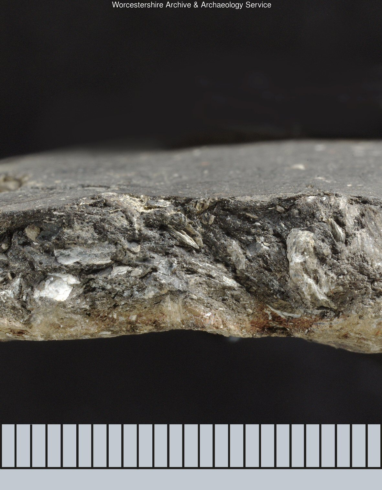
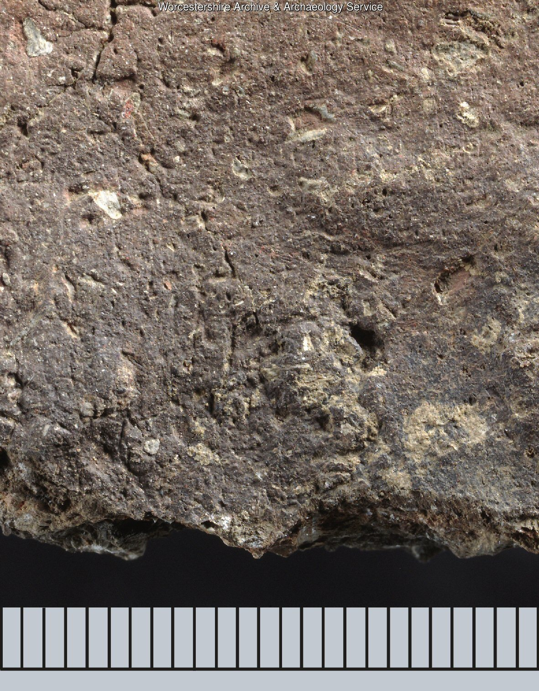
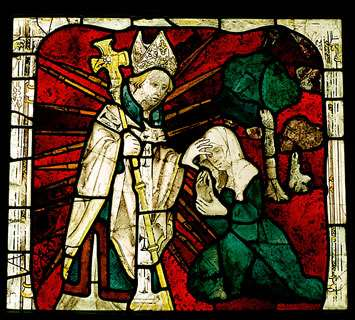
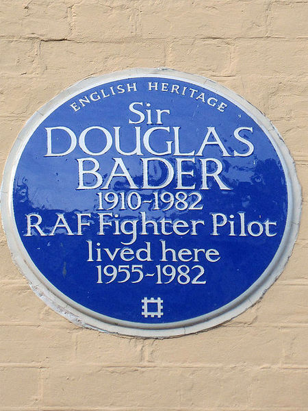
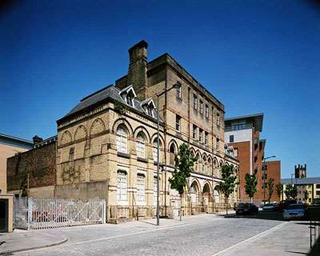

> Discussion and suggestions for new areas of development are welcome!
Anyone interested in heritage data management is welcome to join FISH.

We would like to know what future product developments you want us to focus on. 

Do you need indexing  (e.g. a new controlled vocabulary) or recording advice in a particular subject area? Let us know.

## Pottery Ware and Fabric Type Series

FISH is currently (2019) developing a MIDAS related pottery standard to help with the characterisation of pottery ware 
and fabric type series. It will be supported by a range of controlled vocabularies to facilitate consistent indexing.

Once reviewed by Worcestershire Historic Environment Record (part of Worcestershire Archive & Archaeology Service, which 
produced the [Worcestershire Ceramics](https://www.worcestershireceramics.org/) website); 
the [Prehistoric Ceramics Research Group](https://www.prehistoricpottery.org/) (PCRG); 
the [Study Group for Roman Pottery](https://romanpotterystudy.org.uk/) (SGRP); and 
the [Medieval Pottery Research Group](http://www.medievalpottery.org.uk/) (MPRG), all products will be made available on 
the FISH website.

   

## Lithic artefacts

FISH is also preparing (2019) a thesaurus of lithic artefact terms, largely based on the Norfolk Historic Environment 
Record’s (NHER) indexing guides for worked flint and stone (author Peter Watkins, 2015). This will  be reviewed by lithics 
specialists prior to publication on the FISH website.

## Thesaurus of Cultural Heritage

FISH is currently preparing for the amalgamation of key FISH thesauri into one single thesaurus of tangible heritage.

It will be made available online via a new open source inventory and management system called [ARCHES](https://archesproject.org/), produced by 
the [Getty Conservation Institute and World Monuments Fund](http://archesproject.org/what-is-arches/) on behalf of the international heritage sector.

We hope to illustrate the thesaurus as much as possible and we would be grateful for any help in this area once we are ready 
for that phase of the project.

More information about the _Thesaurus of Cultural Heritage_ may be found on the related [Heritage Data](http://www.heritagedata.org/blog/uber-thesaurus/) website. 

Contact person is [Phil Carlisle](mailto:philip.carlisle@HistoricEngland.org.uk), Historic England.

## Intangible Heritage

UNESCO and UN promote the capture of social and cultural expressions, our [intangible heritage](https://ich.unesco.org/en/lists). Continuing to link places 
and objects to people and events, but now adding the value and meaning people once gave or now give to them. Examples include 
recording local traditions, religious practice, links to slavery and disability, social taboos, forms of entertainment etc.

The Library of Congress has produced an [Ethnographic Thesaurus](http://id.loc.gov/vocabulary/ethnographicTerms.html), covering 
American folklore, but there does not seem to be a UK equivalent. If there is a demand for this, is this something FISH 
can help with?

A thesaurus for intangible heritage may

*  include **cultural expressions** (e.g. dance, social media, traditional crafts, language, hobbies, traditions, festivals),
*  capture the cultural influences of our **ethnic communities** and related issues (e.g. homesickness, interracial marriage, identity and multiculturalism_),
*  identify past and present peoples **faith and beliefs** (folklore, witchcraft, superstition, mythology and interfaith cooperation_),
*  cover **social attitudes** on issues such as slavery, racism,_ views on _marriage, disability, LGBTQ, social stigma, political activism and charitable giving_.

### Inclusive Heritage

Several cultural heritage institutions are working on developing access to more inclusive heritage (e.g. The National Archives,
The British Museum, [Historic England](https://historicengland.org.uk/research/inclusive-heritage/)). The aim is to make it easier for people to find cultural information relating 
to different community groups such as people with disabilities, different ethnic background etc.

### Linking 'Disability'

 
 
 

If you are interested in recording intangible and inclusive heritage, then have a look at the FISH Terminology page where some vocabularies are listed in the [_Other Terminology Resources_](/other-terminology-resources/) section.

### Further Reading

*  [‘Intangible’ and ‘tangible’ heritage - A topology of culture in contexts of faith](http://d-nb.info/1000727173/34). Britta Rudolff, Johannes Gutenberg-University of Mainz, Germany, 2006.
*  [YouTube and the social archiving of intangible heritage](https://journals.sagepub.com/doi/10.1177/1461444812469598)[.](http://nms.sagepub.com/content/early/2013/01/08/1461444812469598.abstract) Sheenagh Pietrobruno, McGill University, Canada & Fatih University, Istanbul, Turkey, 2013.
*  [Children, Childhood and Cultural Heritage](http://www.routledge.com/books/details/9780415529952/). Editors Kate Darian-Smith, Carla Pascoe (Explores how the everyday experiences of children, and their imaginative and creative worlds, are collected, interpreted and displayed in museums and on monuments, and represented through objects and cultural lore), 2012.
*  [Managing Cultural Landscapes](http://www.routledge.com/books/details/9780415672252/). Editors Ken Taylor, Jane Lennon. (Human attachment to landscape and how we find identity in landscape and place), 2012.
*  [Heritage, Labour and the Working Classes](http://www.routledge.com/books/details/9780415618113/). Editors Laurajane Smith, Paul Shackel, Gary Campbell. (Working class culture), 2011.
*  [Places of Pain and Shame](http://www.routledge.com/books/details/9780415454506/) - Dealing with ‘Difficult Heritage’. Editors William Logan, Keir Reeves. (A cross-cultural study of sites that represent painful and/or shameful episodes in a national or local community’s history, and the ways that government agencies, heritage professionals and the communities themselves seek to remember, commemorate and conserve these cases), 2008.
*  [Intangible Heritage](http://www.routledge.com/books/details/9780415473965/). Editors Laurajane Smith, Natsuko Akagawa. (Examines the implications and consequences of the idea of ‘intangible heritage’ to current international academic and policy debates about the meaning and nature of cultural heritage and the management processes developed to protect it), 2008.

### Archaeology in Context

Moving on from building a foundation of minimum information, digital access and interoperability, key developments in digital 
technology and publishing (such as [Linked Open Data](https://www.w3.org/standards/semanticweb/data) and [Open Context](http://opencontext.org/)) 
are now opening up the possibilities of recording the _context_ the data was compiled in for future reuse.

The interpretation and analysis, the wording used, and the scholarly background and reputation of the archaeologists who 
conducted the excavations and field studies, are of historical interest and value when assessing the quality and reliability 
of the compiled data.

Digital access to full reports with scanned images, measurements and diagrams, rather than the basic metadata and summary 
description, is becoming increasingly realistic.

Is this something you or your organization already, or would like to, record? Is this an area for FISH to explore?
