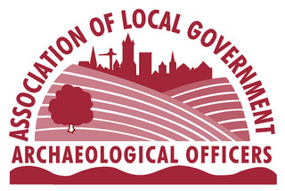
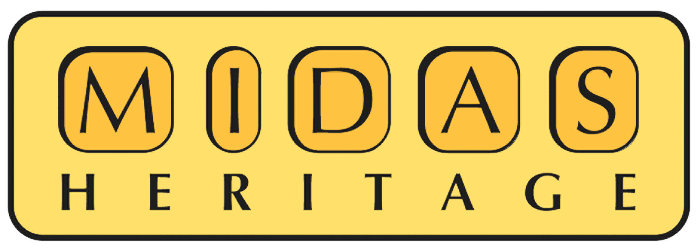
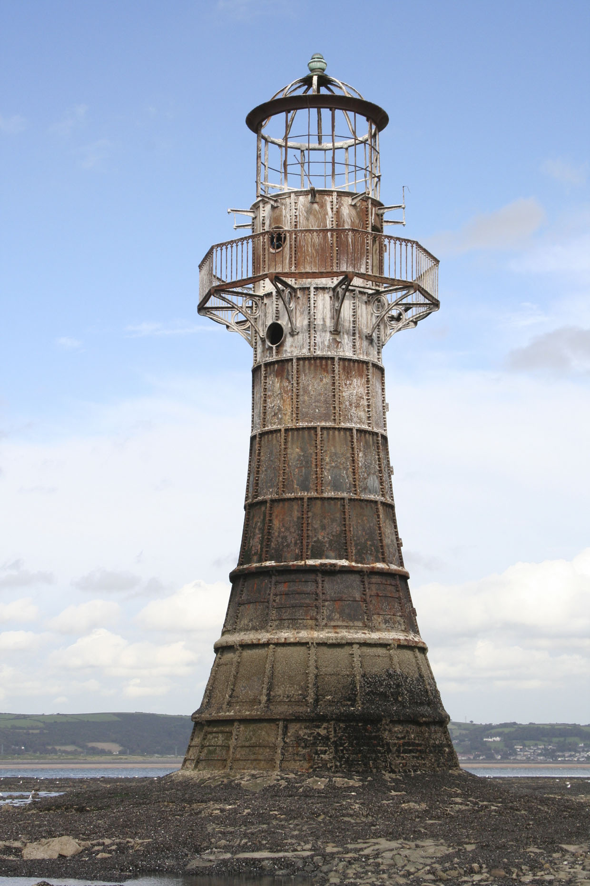
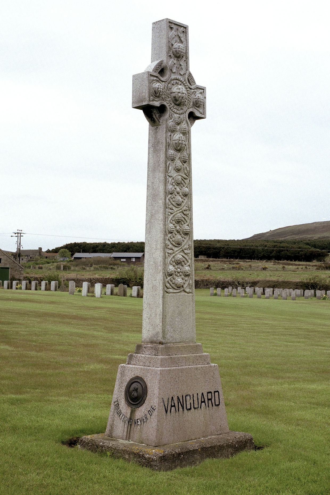

**This page presents the FISH vocabularies in a number of formats, as well as providing the thesaurus table structure and the latest list of candidate terms added to the thesauri.**

All the resources here are free to use and do not require FISH membership.

### Thesauri
- [Archaeological Object Thesaurus](#archaeological-objects-thesaurus)
- [Archaeological Sciences Thesaurus](#archaeological-sciences-thesaurus)
- [Building Materials Thesaurus](#building-materials-thesaurus)
- [Cargo Thesaurus](#cargo-thesaurus)
- [Climate Hazards Thesaurus](#climate-hazards-thesaurus)
- [Components Thesaurus](#components-thesaurus)
- [Defence of Britain Thesaurus](#defence-of-britain-thesaurus)
- [Event Thesaurus](#event-thesaurus)
- [Evidence Thesaurus](#evidence-thesaurus)
- [Farmstead Thesaurus](#farmstead-thesaurus)
- [First World War Thesaurus](#first-world-war-thesaurus)
- [Heritage Crime Thesaurus](#heritage-crime-thesaurus)
- [Historic Aircraft Thesaurus](#historic-aircraft-thesaurus)
- [Historic Characterization Thesaurus](#historic-chararcterization-thesaurus)
- [Manner of Loss](#manner-of-loss)
- [Maritime Craft Thesaurus](#maritime-craft-thesaurus)
- [Maritime Fixtures and Fittings Thesaurus](#maritime-fixtures-and-fittings-thesaurus)
- [Maritime Place Names Thesaurus](#maritime-place-names-thesaurus)
- [Monument Types Thesaurus](#monument-types-thesaurus)
- [Nationality List](#nationality-list)
- [Object Materials Thesaurus](#object-materials-thesaurus)
- [Periods List- superseded](#periods-list)
- [Historic England Periods List](#historic-england-periods-list)
- [Resource Description Thesaurus](#resource-description-thesaurus)
- [Threat Types](#threat-types)

> Thesauri last updated April 2023 (version 26)

All of the csv files, rdf/skos links below are current; however, due to an ongoing technical issue we have been unable to produce updated
pdf versions of the thesauri for this release but they all remain current except for the following six affected thesauri:

1. Archaeological Objects
2. Components
3. Historic Aircraft
4. Monument Type
5. Object Materials
6. Resource Description (Thred).

###  Archaeological Objects Thesaurus

Originally developed by the Archaeological Objects Working Party and published by the [MDA](https://en.wikipedia.org/wiki/Collections_Trust). It provides guidance for the recording of archaeological objects in Britain and Ireland covering all historical periods (e.g. _corn dolly, cremation, cross_). Now maintained by FISH on behalf of the heritage sector.

[Alphabetical](/2021/02/ArchObj_alpha.pdf) [Hierarchical](/2021/02/ArchObj_class.pdf) [Linked Data](https://heritagedata.org/live/schemes/mda_obj.html) [CSV](/2023/04/ArchObjs_v26.zip)

### Archaeological Sciences Thesaurus

Terminology used for recording the techniques, recovery methods and materials associated with archaeological sciences (e.g. _tree-ring analysis, modification state, pathology_). Maintained by Historic England on behalf of the FISH Terminology Working Group.

[Alphabetical](/2024/pdf_files/FISH_Archaeological_Sciences_Alphabetical_20240607.pdf) [Hierarchical](/2024/pdf_files/FISH_Archaeological_Sciences_Hierarchical_20240607.pdf) [Linked Data](http://heritagedata.org/live/schemes/560.html) [Linked Data - rdf/skos](/2024/rdf_files/FISH_Archaeological_Sciences_20240607.rdf) [CSV](/2024/zip_files/FISH_Archaeological_Sciences.zip)

### Building Materials Thesaurus

Terminology used for recording the main construction materials of monuments, buildings and structures relating to the built and buried heritage of the British Isles. Includes natural/animal and man-made material (e.g. _cement mix, fossil, fibre-glass_). Maintained by FISH on behalf of the heritage sector.  

_[Alphabetical](/2021/02/BuildingMats_alpha.pdf) [Hierarchical](/2021/02/BuildingMats_class.pdf) [Linked Data](https://heritagedata.org/live/schemes/eh_tbm.html) [CSV](/2023/04/BuildingMats_v26.zip)_

### Cargo Thesaurus

Thesaurus for types of cargo carried by vessels and aircraft on their final voyage (e.g. _animal fodder, sugar, fuel_). Maintained by Historic England on behalf of the FISH Terminology Working Group.

[Alphabetical](/2021/02/Cargo_alpha.pdf) [Hierarchical](/2021/02/Cargo_class.pdf) [CSV](/2023/04/Cargo_v26.zip)

### Climate Hazards Thesaurus

This vocabulary of climate change hazards, the potential negative climate events that may cause damage or loss, builds on the Climatic Impact-Drivers defined by the Intergovernmental Panel on Climate Change creating a list of climate hazards for heritage.

[Alphabetical](/2024/pdf_files/FISH_Climate_Hazards_Alphabetical.pdf) [Hierarchical](/2024/pdf_files/FISH_Climate_Hazards_Hierarchical.pdf) [Linked Data](https://purl.archive.org/heritagedata/schemes/38076.html) [Linked Data - rdf/skos](/2024/rdf_files/FISH_Climate_Hazards_Vocab_20240327.rdf) [Research Report](https://historicengland.org.uk/research/results/reports/13-2024?search=13%2F2024&searchType=research+report)

### Components Thesaurus

Terminology covering divisions and structural elements of a building or monument. Includes terms that describe areas and spaces, decorative features, fixtures and fittings, machinery and implied features (e.g. _post hole, cartouche, truss_).

[Alphabetical](/2021/02/Components_alpha.pdf) [Hierarchical](/2021/02/Components_class.pdf) [Linked Data](https://purl.org/heritagedata/schemes/eh_com) [CSV](/2023/04/Components_v26.zip)

### Defence of Britain Thesaurus

Terminology relating to the Second World War defence of Britain. This resource is no longer actively maintained, all content can now be found in the FISH Monument Type Thesaurus.

[Alphabetical](/2021/02/DoB_alpha.pdf) [Hierarchical](/2021/02/DoB_class.pdf) [CSV](/2023/04/DoB_v26.zip)

### Event Thesaurus

Use for recording archaeological events, e.g. architectural investigative, data collection exercises; from intrusive interventions into the resource to non-damaging survey events (e.g. _grab sampling, auger survey, remote sensing_).

[Alphabetical](/2024/pdf_files/FISH_Event_Type_Alphabetical_20240528.pdf) [Hierarchical](/2024/pdf_files/FISH_Event_Type_Hierarchical_20240528.pdf) [Linked Data](https://heritagedata.org/live/schemes/agl_et.html)  [Linked Data - rdf/skos](/2024/rdf_files/FISH_Event_Type_20240528.rdf) [CSV](/2024/zip_files/FISH_Event_Type.zip)

### Evidence Thesaurus

Terminology covering the existing physical remains of a monument, or the means by which a monument has been identified where no physical remains exist (e.g. _placename evidence, soilmark, surface deposit_).

[Alphabetical](/2023/04/Evidence_alpha.pdf) [Hierarchical](/2023/04/Evidence_class.pdf) [Linked Data](http://heritagedata.org/live/schemes/eh_evd.html) [CSV](/2023/04/Evidence_v26.zip)

### Farmstead Thesaurus

Thesaurus for indexing different types of farmsteads, related buildings, areas and layouts. This thesaurus does not contain any additional terminology than that held in Monument Type. Further information regarding national farm building types can be found [here](https://historicengland.org.uk/images-books/publications/national-farm-building-types/).

[Alphabetical](/2021/02/Farmsteads_alpha.pdf) [Hierarchical](/2021/02/Farmsteads_class.pdf) [CSV](/2023/04/Farmsteads_v26.zip)

### First World War Thesaurus

For the recording of monuments related to the First World War in the UK. This thesaurus was constructed for the _First World War Home Front Project_ and does not contain any additional terminology than that held in Monument Type.

[Alphabetical](/2021/02/FWW_alpha.pdf) [Hierarchical](/2021/02/FWW_class.pdf) [CSV](/2023/04/FWW_v26.zip)

### Heritage Crime Thesaurus

Thesaurus for indexing types of crime and incidents against heritage assets (e.g. _graffiti, theft, unauthorized diving_).

[Alphabetical](/2021/02/HeritageCrime_alpha.pdf) [Hierarchical](/2021/02/HeritageCrime_class.pdf) [CSV](/2023/04/HeritageCrime_v26.zip)

### Historic Aircraft Thesaurus

Indexing terminology for the recording of aircraft remains and crash sites, listing aircraft types by form, function and manufacturer (e.g. _Atlas, Target, Westland_).

[Alphabetical](/2021/02/Aircraft_alpha.pdf) [Hierarchical](/2021/02/Aircraft_class.pdf) [CSV](/2023/04/HistoricAircraft_v26.zip)

### Historic Characterization Thesaurus

Thesaurus combining Historic Landscape and Historic Seascape Characterization terminology (e.g. _reclaimed land, vineyard, dunes_).

[Alphabetical](/2021/02/HistoricCharacter_alpha.pdf) [Hierarchical](/2021/02/HistoricCharacter_class.pdf) [CSV](/2023/04/HistoricCharacter_v26.zip) [Full text](/2016/05/HistoricCharactFull_-Aug2015.pdf)

### Manner of Loss

A small authority file/ wordlist for indexing types of loss of vessels or aircraft (e.g. _beached, lost, enemy action_).

[XLS](/2023/04/mannerofloss-3.xls) [Linked Data](https://heritagedata.org/live/schemes/78.html)[Linked Data - rdf/skos](/2024/rdf_files/Manner_of_loss_20240520.rdf)[CSV](/2018/01/MannerOfLoss.zip)

### Maritime Craft Thesaurus

Craft types which survive as wrecks for Historic England’s maritime record and can be used to describe types of ship (e.g. _block ship, rescue vessel, net layer_) .

[Alphabetical](/2021/02/MaritimeCraft_alpha.pdf) [Hierarchical](/2021/02/MaritimeCraft_class.pdf) [Linked Data](http://heritagedata.org/live/schemes/eh_tmc.html) [CSV](/2023/04/MarCraft_v26.zip)

### Maritime Fixtures and Fittings Thesaurus

Thesaurus of non-structural, movable items on vessels (e.g. _lifting gear, deadeye, clenched nail_).

[Alphabetical](/2021/02/MaritimeFixFitts_alpha.pdf) [Hierarchical](/2021/02/MaritimeFixFitts_class.pdf) [CSV](/2023/04/MarFixFit_v26.zip)

### Maritime Place Names Thesaurus

Thesaurus for indexing ports of destination and departure for maritime vessels, grouped by continent, island, water or unassigned (e.g. _Isle of Man, Scapa Flow, Gulf of Bothnia_).

[Alphabetical](/2021/02/MarPlaceName_alpha.pdf) [Hierarchical](/2021/02/MarPlaceName_class.pdf) [CSV](/2023/04/MarPlace_v26.zip)

### Monument Types Thesaurus

Terminology relating to the built and buried heritage of the British Isles and used for recording sites, monuments, buildings and structures (e.g. _beer cellar, macula, railway hotel_).

[Alphabetical](/2021/02/Mon_alpha.pdf) [Hierarchical](/2021/02/Mon_class.pdf) [Linked Data](http://heritagedata.org/live/schemes/eh_tmt2.html) [CSV](/2023/04/MonType_v26.zip)

[Class definitions](/2016/05/Definitions-to-the-Classes-in-the-FISH-Thesaurus-of-Monument-Types.docx)

### Nationality List

List of nationalities for indexing vessels and aircraft.

[Alphabetical](/2021/02/Nationality_alpha.pdf) [Hierarchical](/2021/02/Nationality_class.pdf) [CSV](/2023/04/Nationality_v26.zip)

### Object Materials Thesaurus

A thesaurus, originally developed to assist with the recording of materials for maritime wrecks but now used more generally for objects found in findspots. Please use the British Museum Thesaurus for museum objects.

[Alphabetical](/2021/02/ObjectMat_alpha.pdf) [Hierarchical](/2021/02/ObjectMat_class.pdf) [CSV](/2023/04/ObjMats_v26.zip)

### Periods List

List of the main archaeological and cultural periods of Britain. May vary compared to other period lists, this one has been developed by Historic England (e.g. _Mesolithic, Middle Iron Age, Jacobean_). This list has now been superseded by the Historic England Periods List.

[CSV](/2016/05/eh_periods_list_old_version-5.csv)

### Historic England Periods List

Periods and centuries used in Historic England datasets.

[Alphabetical](/2023/04/HE_Periods_20240513_alphabetical.pdf) [Hierarchical](/2023/04/HE_Periods_20240513_hierarchical.pdf) [Linked Data](http://heritagedata.org/live/schemes/eh_period.html) [CSV](/2023/04/NewHE_Periods3.csv) [View](/chronology/)

### Resource Description Thesaurus

Officially called _English Heritage and National Trust Resource Description_, also known as THRED. Terminology for the description of archive type and format, now updated by FISH (e.g. _excavation report, newspaper article, video clip_).

[Alphabetical](/2021/02/Thred_alpha.pdf) [Hierarchical](/2021/02/Thred_class.pdf) [CSV](/2023/04/ResDesTHRED_v26.zip)

### Threat Types

Wordlist for different types of threats to heritage assets (e.g. _coastal erosion, flooding, vandalism_).

[CSV](/2016/05/556_threats-2.csv)

    

## ALGAO Wordlists

On behalf of the [Association of Local Government Archaeological Officers](https://www.algao.org.uk/subject/her) ([ALGAO](http://www.algao.org.uk/subject/her)), FISH also maintain a number of indexing wordlists specific to recording heritage asset management. Although some of the lists are very small, they provide controlled vocabulary for [MIDAS](/midas-heritage/) units of information.

### Consultation Outcome List

This list relates to the MIDAS unit _Management Proposal Outcome_. It is intended to provide the option to audit the effectiveness of recommendations made in response to proposed work or planning applications (e.g. _agreed, followed, withdrawn_).

[CSV](/2016/05/ALGAO_Consultation_outcome.csv)

### Consultation Type

This list relates to the MIDAS unit _Management Proposal Type_. The different contexts of consultations can be recorded, which in turn may determine the appropriate nature, method, procedure to be adopted by the inventory in response to the consultation (e.g. _planning application, listed building consent, conservation area appraisal_).

[CSV](/2016/05/ALGAO_Consultation_Type.csv)

### Event Type List

This list relates to the _Event Type_ unit in MIDAS. It covers both investigative, data-gathering activities which involve a physical intervention in the site and survey events, ie those data-gathering events which do not have a damaging effect on the resource (e.g. _field survey, soil samling, measured survey_).

[CSV](/2016/05/ALGAO_Event_Type.csv)

### Final Outcome List

This list relates to the MIDAS unit _Management Proposal Outcome_. It is intended to provide the option to audit the effectiveness of archaeological recommendations made in response to proposed work or planning applications by recording the final result of the planning application (e.g. _approved with full condition, refused, amended_).

[CSV](/2016/05/ALGAO_Final_outcome.csv)

### Work Proposed List

This list relates to the MIDAS _Management Proposal Work Proposed_ unit of information. It will offer the opportunity to audit the consultations received by SMRs by broad categories recommended by ALGAO (e.g. _building extension, dredging, road construction_).

[CSV](/2016/05/ALGAO_Work_Proposed.csv)

<a href="/other-terminology-resources/" class="btn btn-success">Terminologies from other organisations</a>

### Thesaurus Table Structure

The FISH thesaurus table structure is identical to Historic England's monuments inventory database. Below document is useful when importing FISH thesauri into your database.

<a href="/2016/05/FISH-Thesaurus-Table-Structure.doc" class="btn btn-success">Table structure</a>

## Thesaurus Updates

Every time we release a new version of the FISH thesauri, we also include a simple list of the new terms added. The document below contains terms added to Version 24, along with those considered for addition.

<a href="/2023/04/Terms-added-rejected-March2022-March2023_Final.pdf" class="btn btn-success">New terms list</a>
