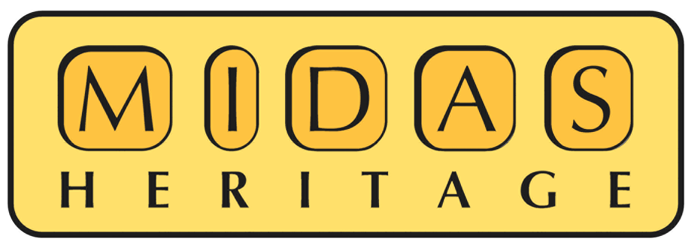

## Introduction, history, best practice, structure & dictionary

In 1998, not long after ICOM produced an international data standard for archaeological sites and monument recording (1995), FISH produced a UK version called _MIDAS_. In 2007 it was expanded to include related information such as GIS (spatial data) and maritime components.

[MIDAS Heritage](https://historicengland.org.uk/images-books/publications/midas-heritage/) is a British cultural heritage standard for recording information on buildings, monuments, archaeological sites, shipwrecks and submerged landscapes, parks and gardens, battlefields, artefacts and ecofacts.

The data standard suggests the minimum level of information needed for recording heritage assets and covers the procedures involved in understanding, protecting and managing these assets. It is used by national government organizations, local authorities, heritage sector organizations, amenity groups and societies, the research community and professional contractors.

<a href="/2015/10/MIDAS_Heritage_2012_update_v5.doc" class="btn btn-success text-center">Download the standard</a>

### History

The first edition, _MIDAS – A Manual and Data Standard for Monument Inventories_, was published by the [Royal Commission on the Historical Monuments of England](https://en.wikipedia.org/wiki/Royal_Commission_on_the_Historical_Monuments_of_England) (RCHME) in 1998. The second edition, published in 2007, was published by [English Heritage](https://en.wikipedia.org/wiki/English_Heritage) (today [Historic England](https://en.wikipedia.org/wiki/Historic_England)).

The standard was developed for and on behalf of the _Forum on Information Standards in Heritage_ (FISH), a discussion forum aimed at helping to resolve standards and recording issues for the whole of the heritage sector.

### Best Practice

MIDAS Heritage incorporates elements from several different standards, such as:

*   [SPECTRUM](http://www.collectionstrust.org.uk/collections-link/collections-management/spectrum/the-spectrum-standard) (artefacts)
*   [UK Gemini Discovery Metadata Standard](http://www.agi.org.uk/agi-groups/standards-committee/uk-gemini) (GIS / geographic information)
*   [CIDOC Conceptual Reference Model](http://www.cidoc-crm.org/) (concepts and relationships)
*   [Informing the Future of the Past: Guidelines for Historic Environment Records](http://archaeologydataservice.ac.uk/ifp/)

MIDAS Heritage complies with the [UK e-Government Metadata Standard](https://en.wikipedia.org/wiki/E-GMS) (e-GMS), which is based on [Dublin Core](http://dublincore.org/documents/dces/).

The standard aims only to provide a common information framework and does not cover:

*   what software or file format to use
*   what to call fields and tables in a database and how they are designed
*   what indexing terms to use
*   how to record archives and museum collections
*   how to redesign an existing information system

### Structure

MIDAS Heritage groups historic environment information into six main _themes_ (e.g. Spatial Information), which consist of more specific _information groups_ (e.g. Location), which all contain a number of specific _information units_ (e.g. Postcode).

1.  _Heritage Assets:_ Areas, Monuments, Artefacts and ecofacts  (_Watercraft and Aircraft_)
2.  _Activities:_ Investigative activities, Designation and protection, Heritage asset management activities, Casework and consultations, Research and analysis, Historical events
3.  _Information Sources:_ Archive and bibliography, Narrative and synthesis, Management activity documentation
4.  _Spatial Information:_ Location, Map depiction
5.  _Temporal Information:_ Dates and periods
6.  _Actor Information:_ Actor and role information

NB! The _Watercraft and Aircraft Annexe_ is available as a separate document.

<a href="/2015/10/MIDAS_Watercraft_and_Aircraft_complete-1.pdf" class="btn btn-success text-center">Download the Watercraft and Aircraft Annexe</a>

    

### Dictionary

The [MIDAS Heritage Dictionary](/2015/10/MIDAS-Heritage-Dictionary-March-2016-PDF.pdf) recommends what information units to include when recording a particular asset or management area, and explains how they should be used. A few information units are mandatory but the majority are optional, depending on the purpose of your inventory.

> There are some minor discrepancies with the Mandatory/ Optional status for a few individual information units which we are aware of and plan to address in the near future.

Each unit of information contains a brief description, guidance on usage, whether a field is free text or controlled and should be populated using a terminology list/ authority file, and one or more examples.

<a href="/2015/10/MIDAS-Heritage-Dictionary-March-2016-PDF.pdf" class="btn btn-success text-center">Download the Dictionary</a>

