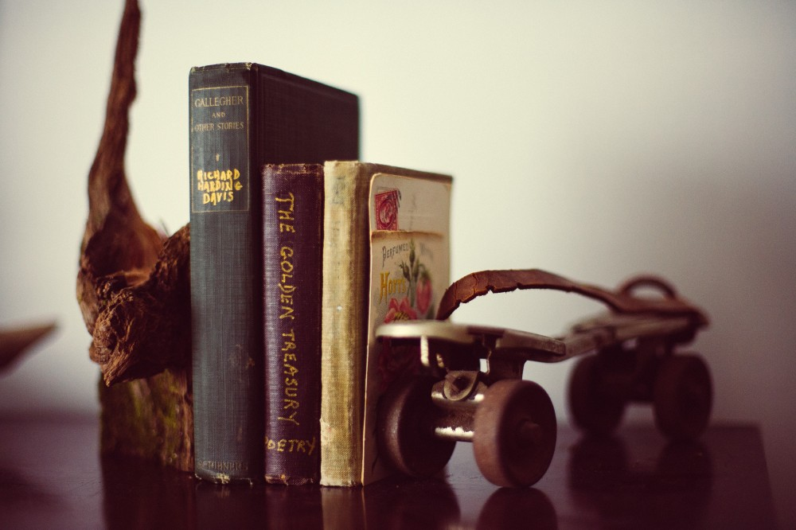

_Vocabularies produced by other organization and terminology for indexing intangible heritage_

**British Museum**

*   [British Museum Materials Thesaurus](http://www.vocabularyserver.com/materials/)   

**Committee of the International Council of Museums (ICOM)** 

*   [Vocabulary of Basic Terms for Cataloguing Costume](https://costume.mini.icom.museum/publications-2/terminology/)  

**Historic England**

*   [Maritime Place Names](http://thesaurus.historicengland.org.uk/thesaurus.asp?thes_no=145&thes_name=FISH%20Maritime%20Place%20Name%20Thesaurus)

**Historic Environment Scotland / Canmore**

*   [Archaeological Objects Thesauru](https://canmore.org.uk/thesaurus?listuid=2)s
*   [Maritime Craft Thesaurus](https://canmore.org.uk/thesaurus?listuid=3)  
*   [Monument Type Thesaurus](https://canmore.org.uk/thesaurus?listuid=1)

**Getty Research Institute**

*   [Art & Architecture Thesaurus (AAT)](http://www.getty.edu/research/tools/vocabularies/aat/)
*   [Cultural Objects Name Authority (CONA](https://www.getty.edu/research/tools/vocabularies/cona/index.html))
*   [Getty Thesaurus of Geographic Names (TGN)](http://www.getty.edu/research/tools/vocabularies/tgn/) 
*   [Union List of Artist Names (ULAN](http://www.getty.edu/research/tools/vocabularies/ulan/))

**Portable Antiquities Scheme**

*   [Denominations _(informal list)_](https://finds.org.uk/datalabs/terminology/denominations) 
*   [Mints _(informal list)_](https://finds.org.uk/datalabs/terminology/mints)
*   [Rulers _(informal list)_](https://finds.org.uk/datalabs/terminology/rulers)

**Royal Commission on the Ancient and Historical Monuments of Wales**

*   [Monument Thesaurus](https://www.heritagedata.org/blog/vocabularies-provided/) 
*   Periods ([Alphabetical list](http://heritagedata.org/live/seneschal_rc_11_20130717_alpha.pdf) / [Download](http://heritagedata.org/live/schemes/11.html))

**UK Data Service**

*   [Humanities and Social Science Electronic Thesaurus (HASSET)](https://hasset.ukdataservice.ac.uk/hasset/en/)

**US Library of Congress**

*   [Subject Headings](http://id.loc.gov/authorities/subjects.html)
*   [Thesaurus for Graphic Materials](http://www.loc.gov/pictures/collection/tgm/) 

### Intangible Heritage

Examples of glossary resources for recording aspects of intangible cultural heritage. More than one resource may be linked to a subject term, e.g. see ‘War’.

Please let us know if you know of other glossaries that may help with indexing.

*   Archival thesaurus, subject terms: [UKAT UK](http://www.ukat.org.uk/)
*   British Empire: [The British Empire](https://www.britishempire.co.uk/glossary/glossary.htm)
*   Disability: [Historic England](https://historicengland.org.uk/research/inclusive-heritage/disability-history/)
*   Diversity: [Pearson Education](http://wps.pearsoned.co.uk/wps/media/objects/2143/2195136/glossary/glossary.html); [Scouts](http://members.scouts.org.uk/supportresources/3914/register)
*   Fashion, Middle Eastern, women: [RAQS](https://www.raqs.co.nz/me/clothing_glossary.html) (New Zealand)
*   Feminism: [KeyWen](http://keywen.com/en/GLOSSARY_OF_FEMINISM)
*   Folklore, American: [Library of Congress Ethnographic Thesaurus](http://id.loc.gov/vocabulary/subjectSchemes/afset.html); English [Oxford Reference](http://www.oxfordreference.com/view/10.1093/acref/9780198607663.001.0001/acref-9780198607663); Scottish [Wikipedia](https://en.wikipedia.org/wiki/Category:Scottish_folklore)
*   Games: [ball – KeyWen](http://keywen.com/en/GLOSSARY_OF_BALL_GAMES); [traditional – Wikipedia](https://en.wikipedia.org/wiki/List_of_traditional_children%27s_games)
*   Gender, transgender: [GLAAD](http://www.glaad.org/reference/transgender)
*   Intellectual property: [WIPO](http://www.wipo.int/tk/en/resources/glossary.html)
*   Medicine, history: [Science Museum](https://webarchive.nationalarchives.gov.uk/20180801134340/http://broughttolife.sciencemuseum.org.uk/broughttolife/) (London)
*   Migration: [UNESCO](https://wayback.archive-it.org/10611/20180705022135/http://www.unesco.org/new/en/social-and-human-sciences/themes/international-migration/glossary/); UK – [National Archives](http://webarchive.nationalarchives.gov.uk/+/http://www.movinghere.org.uk/help/glossary.htm)
*   Music: [Naxos](http://www.naxos.com/education/glossary.asp#)
*   Mythology: Anglo-Saxon – [Wikipedia](https://en.wikipedia.org/wiki/Anglo-Saxon_mythology#Mythology)
*   Slavery and abolition: [The National Archives](https://www.nationalarchives.gov.uk/slavery/pdf/glossary.pdf);  [The Abolition Project](https://abolition.e2bn.org/glossary/view_glossary_0_A.html); [The British Library](http://www.bl.uk/learning/histcitizen/campaignforabolition/abolitionbackground/gloss/abolitionglossary.html); [Understanding Slavery Initiative](http://www.understandingslavery.com/index.php?option=com_glossary&view=glossary&Itemid=89)
*   Slang: [modern – Septic’s Companion](http://septicscompanion.com/showletter.php?letter=all); Edwardian – [Edwardian Promenade](http://www.edwardianpromenade.com/resources/a-glossary-of-slang/); [prison – The English Project](http://www.englishproject.org/resources/prison-lingo-language-prison-community); R.A.F. – [Nature Online / James J. MacIsaac](http://natureonline.com/37/56-ap4-glossary.html)
*   War: First World War, [long glossary –](https://www.nationalarchives.gov.uk/pathways/firstworldwar/glossary/glossary_a.htm#a) National Archives; Cold War: [Global Security / Military](http://www.globalsecurity.org/military/ops/cold-war-glossary.htm); British civil war – [BCW Project](http://bcw-project.org/military/glossary)
*   Witchcraft: [Blue Moon Manor](http://www.blue-moon-manor.com/Glossary/index.html)
*   Women: suffrage – [British Library](http://www.bl.uk/learning/histcitizen/21cc/struggle/suffrage/background/glossary/suffrageglossary.html)

