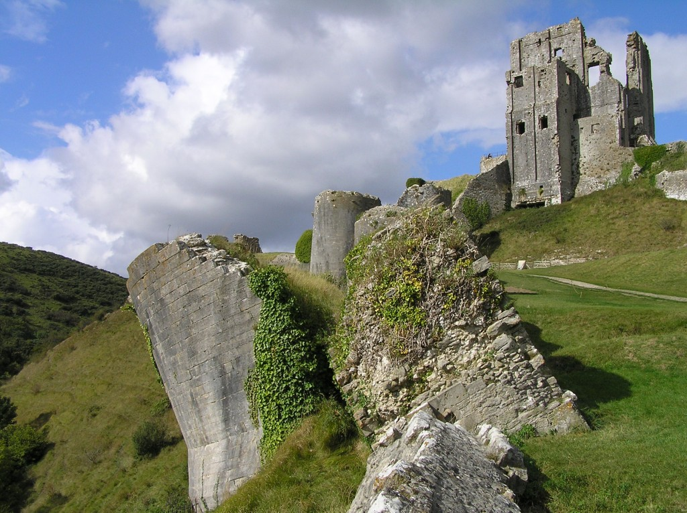

## An introduction to controlled vocabulary, the FISH thesauri and Candidate Terms

Controlled vocabularies enhances access to cultural heritage information. They form bridges between concepts and ideas, material remains and people, and constitute a fundamental part of the documentation process.

Selecting the correct term may vary depending on interpretation or tradition. While our thesauri and authority files are not always right, they usually are a good start. Vocabularies evolve and change over time. With technical developments, such as persistent [URIs](https://en.wikipedia.org/wiki/Uniform_Resource_Identifier), regional synonyms and alternative labels can be added as we agree more on the concept of what something is, rather than the specific terms describing it.

<a href="/fish-vocabularies/" class="mx-2 my-2 btn btn-dark">FISH vocabularies</a>
<a href="/chronology/" class="mx-2 my-2 btn btn-dark">Chronological periods</a>
<a href="/other-terminology-resources/" class="mx-2 my-2 btn btn-dark">Other terminologies</a>

## The FISH Vocabularies

The FISH vocabularies consist of a number of structured terminologies for recording heritage assets such as monuments, buildings, maritime craft, historic aeroplanes, archaeological objects, components and landscapes. They also cover professional management and archaeological event terms (interventions), types of evidence and archaeological sciences (samples, ecofacts).

The vocabularies have been developed over many years, in collaboration with organisations such as [Historic England](https://historicengland.org.uk/) (formerly English Heritage), [ALGAO](http://www.algao.org.uk/), [Collections Trust](http://www.collectionstrust.org.uk/) and the [National Trust](http://www.nationaltrust.org.uk/).

The core FISH vocabularies are downloadable from the _[Heritage Data](http://www.heritagedata.org)_ website. 

The thesauri can be downloaded in _PDF_ or _CSV_ formats. The majority are also available in  Linked Open Data _LOD_ and _SKOS_ formats. The thesauri are refreshed once a year. Open a thesaurus or authority file in CSV or PDF format. (PDF content is listed alphabetically and hierarchically).

All the resources are free to use and do not require FISH membership.

### Candidate Terms

We welcome your feed-back and suggestions on additional terms to include so that the FISH vocabularies remain correct, 
relevant, and inclusive. Submit a Candidate Term to any of our terminology resources and include a description (scope note), 
example of usage and references.

## Coverage

These terminologies cover a wide range of materials and objects.

### Archaeology

*   archaeological science thesaurus
*   archaeological events thesaurus
*   evidence thesaurus
*   manner of loss list

### Archive

*   resource description thesaurus

### Artefact

*   archaeological objects thesaurus
*   components thesaurus\*
*   maritime cargo thesaurus

### Heritage

*   heritage crime thesaurus
*   historic characterisation thesaurus (land and sea)
*   nationality list
*   threat list
*   building materials thesaurus

### Monument

*   components thesaurus
*   historic aircraft thesaurus
*   maritime craft thesaurus
*   monuments thesaurus
    *   Defence of Britain _(project)_
    *   Farmsteads _(project)_
    *   First World War _(project)_
