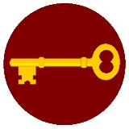

English Heritage, the Royal Commission on the Ancient and Historical Monuments of Scotland, Royal Commission on the Ancient 
and Historical Monuments of Wales, the Archaeology Data Service and the University of South Wales are pleased to announce 
that cultural heritage thesauri and vocabularies are now freely available as Linked Open Data as a preliminary outcome of 
the [SENESCHAL](http://www.heritagedata.org/blog/about-heritage-data/seneschal/) project at: [http://www.heritagedata.org.](http://www.heritagedata.org.)

The vocabularies, which include concepts relating to monument types, archaeological objects, events and time periods and 
maritime craft are also available for download in [SKOS](http://en.wikipedia.org/wiki/Simple_Knowledge_Organization_System) format. 

