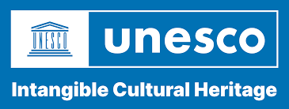

A new _Special Interest Group_ has been set up for _Under-Represented and Intangible Heritage_ (URIH-SIG). Over the last 
few years various projects and seminars have explored ways in which heritage organizations can make their records more 
accessible to users interested in aspects of faith, gender, ethnicity, women, sexuality and intangible heritage (e.g. 
folklore, music, dance). To assist in the consistent indexing of records held by museums, libraries, archives and heritage 
organizations (the cultural heritage sector) a terminology working group is being established. 

The group will focus on identifying existing terminologies and standardized vocabularies for use in recording diversity. 
Its main aims will be to encourage the use of, and access to, collections, archives and records systems and to develop guidance 
for the recording of objects relating to under-represented heritage. The Special Interest Group will report to FISH via 
the [FISH Terminology Working Group](/working-groups/) (FISH-TWG). 

Further information on intangible heritage can be found on the [UNESCO website](http://en.unesco.org/themes/intangible-cultural-heritage). 

