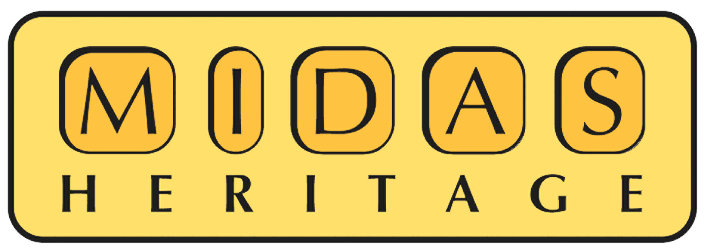

The [Qatar Museums Authority](http://www.qm.org.qa/en) (QMA) and the VISTA Centre at [University of Birmingham](http://www.birmingham.ac.uk/index.aspx) have recently developed 
a bespoke bilingual and fully integrated Cultural Heritage Management Application in Access database and ArcGIS. 

The new customized application uses Open Source code. The [MIDAS Heritage](http://en.wikipedia.org/wiki/MIDAS_Heritage) data standard - developed and expanded by 
FISH in 2008 - was reviewed as part of the development process. It is hoped this cultural resource management tool will be 
used by other Historic Environment Records in the Middle East in the near future. 

The two main components of the QNHER system are the user interface and the server [APIs](http://en.wikipedia.org/wiki/API). The user interface is an 
[HTML5](http://en.wikipedia.org/wiki/HTML5) client application which runs in a web browser over the Internet. It communicates with the server via a set 
of open APIs. The server APIs are exposed via a [Proxy Server](http://en.wikipedia.org/wiki/Proxy_server) and all traffic between the Internet and the server 
is encrypted using [HTTPS](http://en.wikipedia.org/wiki/HTTPS). 

For more information, please read this [seminar paper](http://www.academia.edu/2454465/The_Qatar_National_Historic_Environment_Record_a_bespoke_cultural_resource_management_tool_and_the_wider_implications_for_heritage_management_within_the_region) about the project (published 2010) or contact Richard Cuttler, 
Senior Project Manager, IBM VISTA, Institute of Archaeology and Antiquity, University of Birmingham. 

 
