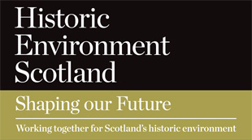

Historic Environment Scotland, the new lead public body for the country’s historic 
environment, brings together _Historic Scotland_ and the _Royal Commission on the Ancient and Historic Monuments of Scotland_, and will continue to be a vital member of FISH.

More information on the merger can be found [here](https://www.historicenvironment.scot/about-us/).

