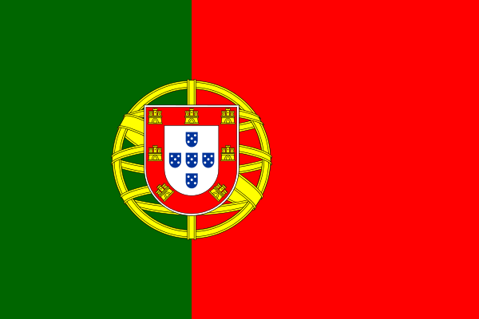

The International [UDC](http://www.udcc.org/2015) Seminar entitled "[Classification & Authority Control: Expanding Resource Discovery](http://seminar.udcc.org/2015/)" will take place in **The National Library of Portugal** **in Lisbon, on 29-30 October 2015**.

Linked data practices and techniques have opened new possibilities in exploiting controlled vocabularies and improving resource discovery. Authority data held in library systems often includes classification schemes. These knowledge structures now have the potential for being shared across the linked data environment. The objective of the conference is to explore issues in managing classification vocabulary in and between information systems. Particular emphasis will be on the possibilities for exploiting and sharing subject authority data in the linked data environment.

     

