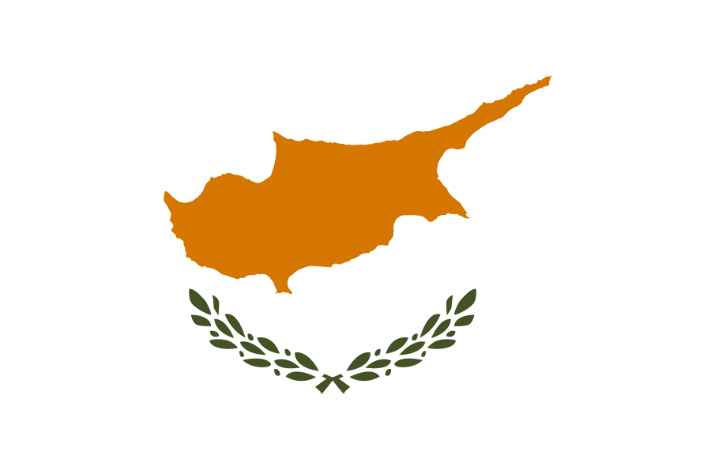

International Euro-Mediterranean Conference (EuroMed) - Call for Participation **31 October - 5 November 2016, Lemessos, Cyprus**

The International Conference on Cultural Heritage (CH) brings together researchers, policy makers, professionals and practitioners 
to explore some of the more pressing issues concerning cultural heritage today. The main goal of the conference is to focus 
on interdisciplinary and multi-disciplinary research on tangible and intangible Cultural Heritage, the use of cutting edge 
technologies for the protection, restoration, preservation, massive digitization, documentation and presentation of the CH content.

More information can be found on the [Euromed](http://www.euromed2016.eu/index.php/call-participation) conference website.

   

