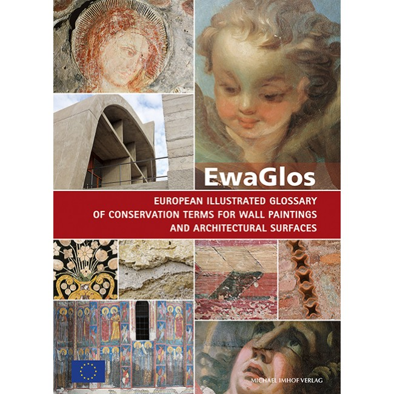
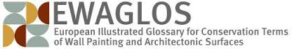

The EU funded [EwaGlos Project](http://www.ewaglos.eu/) has produced a downloadable PDF version of _The Illustrated 
Glossary of Conservation Terms for Wall Paintings and Architectural Surfaces_ (October 2015).

> 'EwaGlos, which has been developed in eleven languages, highlights the crucial role that professionally developed 
> multilingual vocabularies play in international preservation campaigns. The illustrated glossary stresses the importance 
> of a common language in the conservation field, and the role that international cooperation plays in creating this common 
> terminology. The core of the glossary comprises approximately 200 definitions of terms frequently used in specifications 
> in the field of conservation-restoration of wall paintings and architectural surfaces.'

Click [here](http://openarchive.icomos.org/id/eprint/1706/) to download the free glossary.

