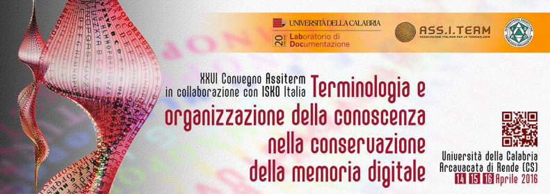

The conference will take place **14-16 April 2016**, at the University Club of the Università della Calabria, Italy.

The event is organized by Associazione Italiana per la Terminologia (Ass.I.Term),
the Italian section of the International Society for Knowledge Organization (ISKO), and the Documentation Laboratory (LabDoc).

The conference aims to stimulate discussion and facilitate information exchange within
the framework of terminological research, as well as knowledge management for the
preservation of digital memories.

  
