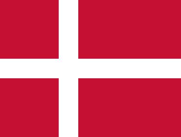
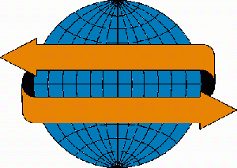

The 12th international conference on Terminology and Knowledge Engineering, TKE 2016, is organised by GTW and the 
Department of International Business Communication, Copenhagen Business School, in cooperation with TermNet and other 
associations and consortia, national and international organisations. 

Location: [Copenhagen Business School,](http://www.cbs.dk/en) Copenhagen  
Conference - 22-23 June 2016: Term Bases and Linguistic Linked Open Data   
**Workshop - 24 June 2016**: Making the visualization of concepts more attractive and smarter

## Topics

*   Visual representation in terminology
*   Concept analysis and visualization
*   Text visualization and analytics
*   Taxonomies for visual data categories
*   Ontologies for pictures and their elements
*   Linked Open Data Visualization
*   Visual categories in terminology
*   Diagrammatic reasoning
*   Hybrid reasoning (reasoning supported by images and symbols)
*   Spatial ontologies
*   Visual cultures
*   Ethical issues of visualization

    
