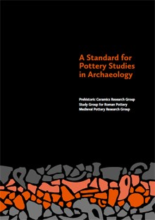

Published in June 2016, this guidance document was compiled by the three period-specific
pottery study groups (PCRG, SGRP, MPRG) with the aim of creating the first, comprehensive,
inclusive standard for working with pottery.

The Standard is intended for use in all types of archaeological project, including
those run by community groups, professional contractors and research institutions.
This standard has been published by the [Medieval Pottery Research Group](http://www.medievalpottery.org.uk/)
on behalf of the [Prehistoric Ceramics Research Group](https://www.prehistoricpottery.org/),
the [Study Group for Roman Pottery](http://romanpotterystudy.org/) and the [Medieval Pottery Research Group](http://www.medievalpottery.org.uk/).

The text was written by Alistair Barclay and David Knight (PCRG); Paul Booth and Jane Evans (SGRP); Duncan H. Brown and Imogen Wood (MPRG).

Development and production of this standard was funded by grant-aid from [Historic England](https://historicengland.org.uk/images-books/publications/standard-for-pottery-studies-in-archaeology/).

