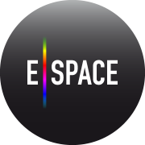

Cultural Heritage: Reuse, Remake, Reimagine _Berlin, (Germany), 21-22 November 2016_ Venue: [Hamburger Bahnhof Museum of Contemporary Art](http://www.smb.museum/en/museums-institutions/hamburger-bahnhof/home.html).

Digitization is progressing at Cultural Institutions, and previously hidden treasures
of Cultural Heritage are becoming visible. However, in today’s digital society
existing on the web is not enough. Audiences want to engage with culture, they
want to create their own stories not just read the ones that exist, they want to
integrate the information in their teaching, their creative projects, they want
to play with the material, not only look at it: they want to reuse, they want to
remake, they want to reimagine.

The third conference from the [Europeana Space project](http://www.europeana-space.eu/) will showcase the myriad ways that 
cultural heritage can be used and enriched through new technologies, innovation and the ingenuity of the creative industries. 

Attendance is free. [Click here for more information.](http://www.europeana-space.eu/conferences/berlinconference2016/)  
   

