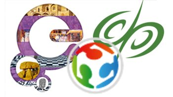

Derry (Northern Ireland), 11-12 October 2016 CARARE Best Practice Network has joined forces with the Discovery Programme and the FabLab Nerve Centre to organise two days of Digital Heritage Events in Derry Guildhall, Northern Ireland with the focus on looking at how we can promote digital cultural heritage data (with the focus on archaeology and architecture) and how it can be re-used across a range of sectors.

### Programme

*   A hands-on workshop for school children and teachers “How can education reuse data?”, organised in conjunction with the FabLab
*   CARARE network meeting
*   A workshop/assembly to explore the uses of cultural heritage data across education, tourism, the creative industries and in communities for co-creation projects.

The CARARE Best Practice Network was funded under the European Commission’s ICT Policy Support Programme and was designed to involve and support Europe’s network of heritage agencies and organisations, archaeological museums and research institutions and specialist digital archives in:_

*   making the digital content for the archaeology and architectural heritage that they hold available through Europeana
*   aggregating content and delivering services
*   and enabling access to 3D and Virtual Reality content through Europeana.

CARARE website: [http://www.carare.eu/ ](http://www.carare.eu/)

