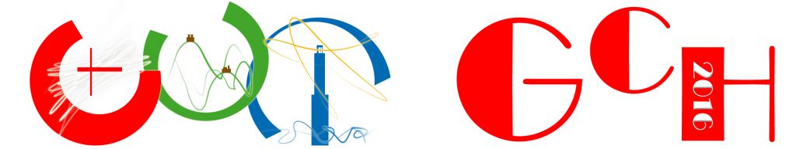

Genova, Italy, 5-7 October 2016. The 14th EUROGRAPHICS Workshop on Graphics and
Cultural Heritage (GCH 2016) aims to foster an international dialogue between ICT
experts and CH scientists to have a better understanding of the critical requirements
for processing, managing, and delivering cultural information to a broader audience.

The objective of the workshop is to present and showcase new developments within
the overall process chain, from data acquisition, analysis and synthesis, 3D
documentation, and data management, to new forms of interactive presentations and
3D printing solutions.

Interdisciplinary approaches for analysis, classification and interpretation of cultural
artefacts are particularly relevant to the event.

The intention of GCH 2016 is also to establish a scientific forum for scientists and
CH professionals to exchange and disseminate novel ideas and techniques in research,
education and dissemination of Cultural Heritage, transfer them in practice, and
trace future research and technological directions.

### Topics

* 2/3/4D data acquisition and processing in Cultural Heritage
* Multispectral imaging and data fusion
* Digital acquisition, representation and communication of intangible heritage
* Material acquisition analysis
* Heterogeneous data collection, integration and management
* 3D printing of cultural assets
* Shape analysis and interpretation
* Similarity and search of digital artefacts
* Visualization and Virtual Museums
* Multi-modal and interactive environments and applications for Cultural Heritage
* Spatial and mobile augmentation of physical collections with digital presentations
* Semantic-aware representation of digital artefacts (metadata, classification schemes, annotation)
* Digital libraries and archiving of 3D documents * Standards and documentation * Serious games in Cultural Heritage
* Storytelling and design of heritage communications

    
