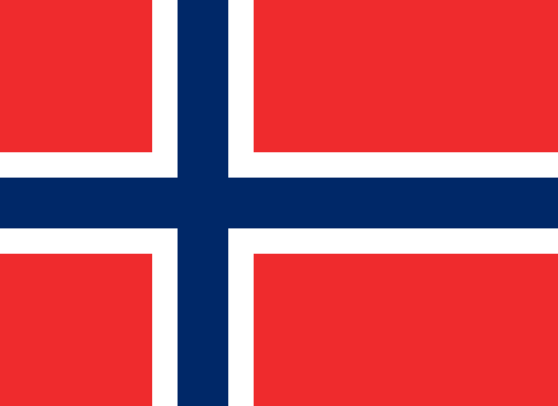
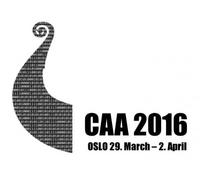

The next Computer Applications and Quantitative Methods in Archaeology Conference (CAA 2016 Oslo) will take place **29 March to 2 April 2016 in Oslo, Norway**. The focus will be on access, discovery and research reuse of archaeological datasets, and aims to stimulate discussion between researchers and data specialists, and to:

*   Showcase best practices and relevant work supporting access and use of digital archaeology from ARIADNE and other services
*   Present case studies demonstrating innovative re-use of archaeological datasets
*   Develop an understanding of the challenges in providing access to research data and the opportunities offered by ARIADNE and other services
*   Discuss how these challenges can be addressed and how the opportunities can be maximized
*   Generate ideas for future training, access and research

Other topics will include data acquisition and recording, conceptual modelling, semantic technologies, data analysis, data management, digital 3D object reconstruction, image visualisation in archaeology, geophysics and GIS. Click [here](http://caa-international.org/about/) for information about CAA and here for more information about the event.

 
