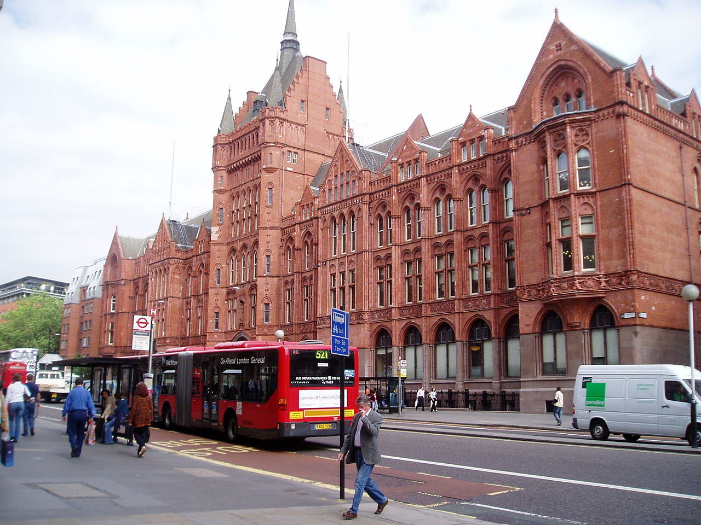

FISH members attending the next **FISH-HEIRNET Spring Meeting**

This will take place at Historic England's main office in Waterhouse Square, London, on **Friday 9 June 2017**. 

Time: 11.00 – 16:00. (Working Lunch provided at 13:00).

Topics will include [BIM4Heritage](http://bim4heritage.org/), how heritage terminologies map to BIM,
updates on [OASIS,](http://oasis.ac.uk/pages/wiki/Main) the [Thesaurus of Cultural Heritage](http://www.heritagedata.org/blog/the-thesaurus-that-time-forgot/#more-168),
HIAS (including HERALD), and reports from FISH contributing organisations.

See [London Meeting Agenda](FISH-June-9th-meeting-2017-draft-agenda.doc) for more details. 

HERALD: Historic Environment Research Archives, Links and Data is the project name given
to the redevelopment of the OASIS system and Stage 1 ran from January 2014 to May 2015.

The project involved consulting the users from different sectors of the historic environment
community using a combination of workshops,  surveys, telephone interviews to produce
a number of survey reports.

This then informed the design of a mock up of a new OASIS system to test potential changes
in workflows and content gathered. The comments received from the community on the
mock up and the survey reports went on to produce the recommendations for a new system in the final report.
