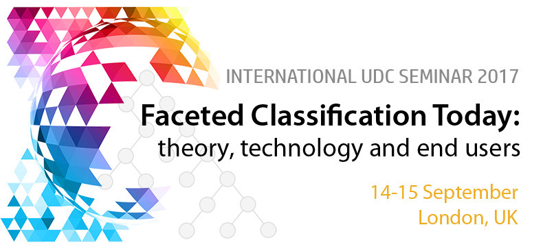

The International UDC Seminar 2017 "**Faceted Classification Today: Theory, Technology and End Users**" will take place 
in London on **14-15 September 2017** at the **Wellcome Collection**. 

This is the sixth in a series of International UDC Seminars devoted to advances in 
documentary classification research and their application in a networked environment. This conference revisits faceted 
analytical theory as a method for (re)constructing modern analytico-synthetic classifications and explores potential fields 
of application for facet analysis in information organization. It is aimed at information professionals, researchers, 
lecturers in library and information science and computer science as well as controlled vocabulary developers and designers. 

Title: _FACETED CLASSIFICATION TODAY: theory, technology and end users_ 
Date:  14-15 September 2017  
Venue: Wellcome Collection Building, 183 Euston Road, London, United Kingdom   
Contact: [mailto:seminar2017@udcc.org](mailto:seminar2017@udcc.org) UDC Seminar 2017 revisits 
[faceted analytical theory](http://www.ucl.ac.uk/fatks/paper2.htm) as one of the most influential methodologies in the 
development of knowledge organization systems. To learn more about the conference programme and to register, go to the 
conference website [http://seminar.udcc.org/2017/](http://seminar.udcc.org/2017/) 

 

About the organizer: "Faceted Classification Today" is the sixth biennial conference in a series of International UDC 
Seminars organized by the Universal Decimal Classification Consortium (UDC Consortium). UDCC is a not-for-profit organization, 
based in The Hague, established to maintain and distribute the UDC and to support its use and development 
([http://www.udcc.org](http://www.udcc.org)). UDC is one of the most widely used knowledge organization systems in the 
bibliographic domain. 

