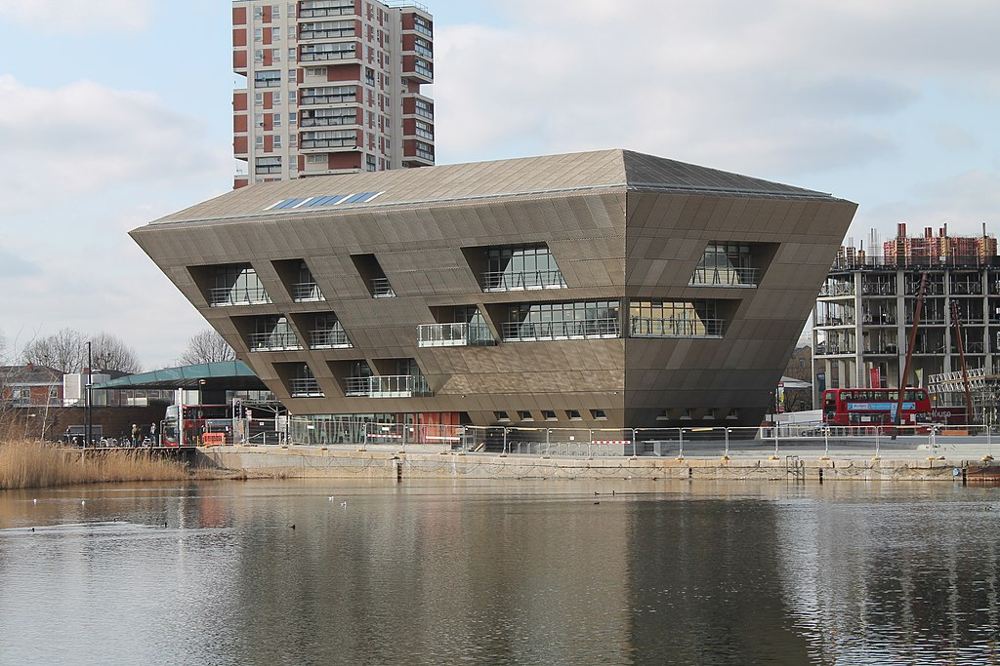

## "Knowledge Organisation: what's the story?"

Classification, Indexing, Taxonomies and Ontologies - current state and direction of travel.

*   Who: ISKO - International Society for Knowledge Organization
*   When: 11-12 September 2017
*   Where: [Canada Water Library and Cultural Space, London](http://www.southwark.gov.uk/libraries/find-a-library?chapter=5)

'One of the highlights of the conference will be the second day's "False Narratives" session, aiming to develop a KO 
response to post-truth phenomena such as Fake news, Alternative facts, Social media echo chambers and other worrying 
developments. Not everyone is worried, though. According to some analyses, fake news may not have had  much impact on 
events such as the 2016 US presidential election. Should we worry more about the home-grown bias  of personalized feeds 
from our web browsers? Enlightenment on the technical issues, and energy to pursue solutions, will come from our first 
two speakers in this special session on 12 September:

*   a research project led by the innovative _Dave Clarke_ explores ways of combating the post-truth phenomena, in consultation 
* with leading information professionals;
*   just 3 months after the snap election, _Nick Poole_ reports on CILIP's "Facts Matter" campaign and where we go from here.'

            

