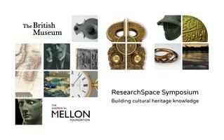

For anyone attending the _Building Cultural Heritage Knowledge Conference_ on 27-28 July, there is also an opportunity to 
attend a free workshop called **'[How to build a semantic web database in one morning](https://www.eventbrite.co.uk/e/how-to-build-a-semantic-web-database-in-one-morning-tickets-33893615717)'.

Saturday 29 July 2017, 09:00 – 13:00 BST British Museum, Great Russell Street, London WC1B 3DG 

Sackler Seminar Rooms, Clore Conference Center 

This workshop is **only open to delegates** attending the **ResearchSpace Symposium, [Building Cultural Heritage Knowledge](https://www.eventbrite.co.uk/e/building-cultural-heritage-knowledge-tickets-33012703886) on 27th/28th July**. 

The objective is to model and build a live Semantic Web database with data input and presentation features. The workshop will 
introduce delegates to Semantic modelling, the [CIDOC CRM](https://en.wikipedia.org/wiki/CIDOC_Conceptual_Reference_Model) ontology and the ResearchSpace Semantic Web Database Builder. 
Other working examples will also be discussed. There are no technical requirements and cultural heritage subject experts interested 
in digital knowledge representation are encouraged to attend and anyone wanting to implement a Semantic Web, Linked Data, site. 

Attendees should bring their own laptop. 

To register for the workshop, please go here: [https://www.eventbrite.co.uk/e/how-to-build-a-semantic-web-database-in-one-morning-tickets-33893615717](https://www.eventbrite.co.uk/e/how-to-build-a-semantic-web-database-in-one-morning-tickets-33893615717)

