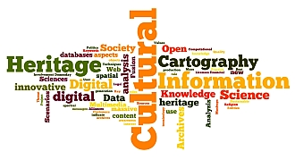

The **DCH2017 Interdisciplinary Conference on Digital Cultural Heritage** takes place at Berlin, Staatsbibliothek Berlin, **August 30- September 01, 2017**.

Conference topics will cover technical challenges as well as strategic guidance. Conference aims:

*   raise awareness in Society, Science, and Technology fields about importance of the cultural dimensions and the growing potential of Digital Cultural Heritage;
*   promote innovative content analysis from cross-organizational interoperability of digital humanities databases and XML methods, techniques, and approaches;
*   indicate on the central role of spatial concepts enabling synergy for knowledge generation from massive granular digital cultural heritage content;
*   create innovative cross-disciplines / cross sectors partnerships facilitate intercultural and interdisciplinary dialogue;
*   elaborate roles and interest of information society.

The conference is organised by [CODATA Germany](http://www.codata-germany.org/)

