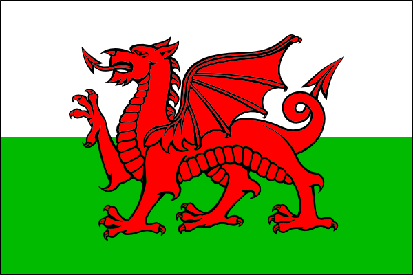

[The National Standard and Guidance to Best Practice for Collecting and Depositing Archaeological Archives in Wales](http://www.welshmuseumsfederation.org/en/news-archive/resources-landing/Collections/national-standard-and-guidance-for-collecting-and-depositing-archaeological-archives-in-wales-2017.html) comprises 
a suite of documents which aim to make archaeological data, information and knowledge available, stable, consistent and 
accessible for present and future generations. _The Standard for Archaeological Archiving in Wales_ consists of a set of 
high-level principles. It represents the standard for archaeological archiving that must be met by an archaeologist or 
organisation undertaking any form of archaeological work that results in an archive.

[Guidance documents are available as a 'zip' file](http://www.welshmuseumsfederation.org/uploads/online%20resources/National%20Archaeology%20standards%20wales%202017/fwdnationalstandards.zip)

This document has been prepared by the National Panel for Archaeological Archives in Wales and is drawn from 
_A Standard and Guide to Best Practice for Archaeological Archiving in Europe_.

The National Panel has tailored this document to meet the specific needs of Wales and to offer guidance that supports the 
Historic Environment (Wales) Act 2016. The National Panel for Archaeological Archives in Wales is an advisory body established 
by the Historic Environment Group with a remit to promote the care of and encourage access to the archaeological archives of Wales.

     
