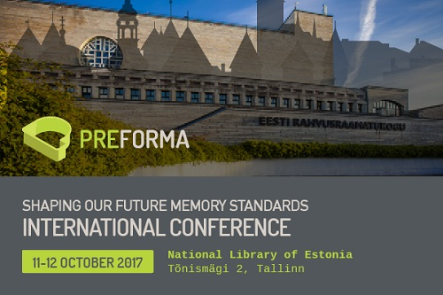

[PREFORMA International Conference – Shaping our future memory standards](http://www.digitalmeetsculture.net/article/preforma-international-conference/)

National Library of Estonia, Tallinn on 11-12 October 2017**. Aim of the event is to highlight the importance of 
standardisation and file format validation for the long term preservation of digital cultural content, 
present the open source conformance checkers developed in PREFORMA and look at future challenges and opportunities. 

Hosted by the _National Library of Estonia_, the conference will include: keynote speeches by international experts in 
digital preservation; live demonstrations of the software; examples and good practices of memory institutions that are 
integrating the PREFORMA tools in their environments; and panel discussions to reflect on how to sustain and further 
develop the results of the project. The event is intended for anyone dealing with digital preservation of images, 
documents and audiovisual files. 

This conference is a great opportunity to ask and exchange with international experts, fellow archivists and even Open 
Source developers about file format questions, issues and challenges we are facing today. 

