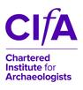

**CIfA conference, Newcastle University, 19 to 21 April 2017**

One of the sessions will be: _'Down amongst the dead men – The Bedern Group, digital preservation and the Historic Environment' _ Peter McKeague, Kirsty Lingstadt , Emily Nimmo and Louisa Matthews

**Call for papers**

Digital technologies play a central role in documenting our heritage and provide a vital resource for creative, cultural and commercial activities in archaeology and beyond. Yet, without long-term commitment to active preservation and access, this resource is under threat from loss, fragmentation and obsolescence and will ultimately be lost. Digital Preservation requires effective management, meaningful access and reliable, verifiable research to ensure the potential of data is realised. Collaboration between data creators and curators is key to preservation management and ensures data remains accessible for posterity. Convened under the auspices of the Digital Preservation Coalition, the [Bedern Group](https://www.dpconline.org/digipres/bedern-group-home) is an alliance of key agencies concerned with the long term preservation of the intellectual record of the historic environment of the UK. We welcome papers for our session from data creators and curators addressing issues such as awareness, training, collecting and charging policies, data standards and accessibility Proposals for this particular session needs to be submitted to [peter.mckeague@rcahms.gov.uk](mailto:peter.mckeague@rcahms.gov.uk), Historic Environment Scotland.

**Deadline: 14 October 2016**

For further details  about the conference and list of proposed sessions please see: [http://archaeologists.net/conference/2017](http://archaeologists.net/conference/2017)

