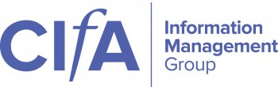

The Chartered Institute for Archaeologists' (CIfA) [Information Management Special Interest Group](http://www.archaeologists.net/groups/imsig?utm_source=newsletter&utm_medium=email&utm_campaign=data_management_cpd_workshop_imsig_agm&utm_term=2017-10-25) (IMSIG) will be 
hosting a workshop on creating data management plans on **Wednesday 29 November**. 

 

Location: **Comfort Inn**, Station Street, Birmingham B5 4DY  _(a 6-minute walk from Birmingham New Street 
train station)_ 

Lunch, tea and coffee will be provided. Registration will open at 10:30 with the event running from 11-3 with a break in 
the middle for the AGM over lunch.  

### Data Management - a Life Cycle Approach

The workshop will be built around a series of interactive exercises where participants will investigate a set of data to 
find the clues they need to populate a data management plan and develop metadata. Participants will re-name the data 
by applying our file-naming convention and save the data into our **[MORPHE](https://historicengland.org.uk/images-books/publications/morphe-project-managers-guide/)** based folder structure. 

s the clues come together and the limits of what can be done are reached we hope the exercise will help participants 
understand the consequences of leaving data management and archiving to the end of projects and why it is essential to 
adopt a life cycle approach. 

This workshop will use the [**ADAPt**](https://historicengland.org.uk/research/methods/archaeology/archaeological-archives/adapt-tookit/) (Archaeological Digital Archiving Protocol) developed by Claire Tsang and 
Hugh Corley to support the Excavation & Analysis Teams at [Historic England](https://historicengland.org.uk/) as presented at last year’s CIfA 
Conference.

