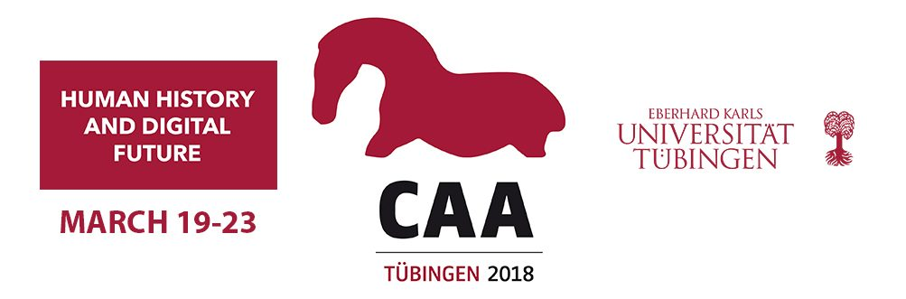

The 2018 **[Computer Applications and Quantitative Methods in Archaeology](http://2018.caaconference.org/)** (CAA)  conference
will take place between 19-23 March, at the University of Tübingen, Germany.

The Computer Applications and Quantitative Methods in Archaeology (CAA) Annual Conference is one of the major events in
the calendar for scholars, specialists and experts in the field of computing technologies applied to archaeology.
The 46th Computer Applications and Quantitative Methods in Archaeology Conference (CAA 2018) has been given the theme
_“Human history and digital future”_.

The conference will address a multitude of topics. Through diverse case studies from all over the world, the conference
will show new technical approaches and best practice from various archaeological and computer-science disciplines.

The conference will bring together hundreds of participants from around the world in parallel sessions, workshops, tutorials
and round tables. For general information about the conference: [caa2018@caaconference.org](mailto:caa2018@caaconference.org)

